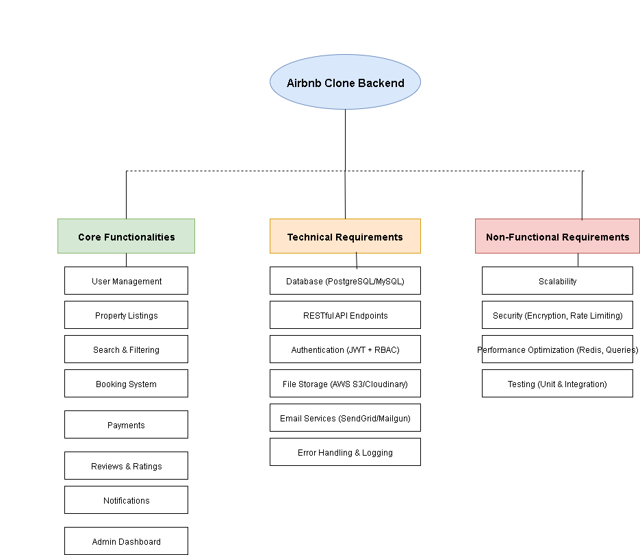

# 🏡 Airbnb Clone – Features & Requirements

## 🔑 Core Features

### 👤 User Management
- Registration (Guest/Host)
- Login & Authentication (JWT, OAuth)
- Profile Management (update info, photos, preferences)

### 🏠 Property Listings
- Add new property
- Edit property
- Delete property
- Upload images

### 🔎 Search & Filtering
- Search by location, price, guests, amenities
- Pagination for results

### 📅 Booking System
- Create booking
- Cancel booking
- Track booking status (pending, confirmed, canceled, completed)

### 💳 Payments
- Secure payments via Stripe/PayPal
- Payouts to hosts
- Multi-currency support

### ⭐ Reviews & Ratings
- Guests leave reviews
- Hosts respond
- Reviews linked to bookings

### 🔔 Notifications
- Booking confirmations
- Cancellations
- Payment updates

### 🛡️ Admin Dashboard
- Manage users
- Manage listings
- Manage bookings
- Monitor payments

---

## 🛠 Technical Requirements
- **Database:** PostgreSQL / MySQL  
- **APIs:** RESTful (GET, POST, PUT, DELETE)  
- **Authentication:** JWT + RBAC  
- **File Storage:** AWS S3 / Cloudinary (or local for dev)  
- **Email Services:** SendGrid / Mailgun  
- **Error Handling & Logging**  

---

## 🚀 Non-Functional Requirements
- **Scalability**  
- **Security:** encryption, firewalls, rate-limiting  
- **Performance:** caching with Redis, optimized queries  
- **Testing:** unit, integration, automated API tests  

