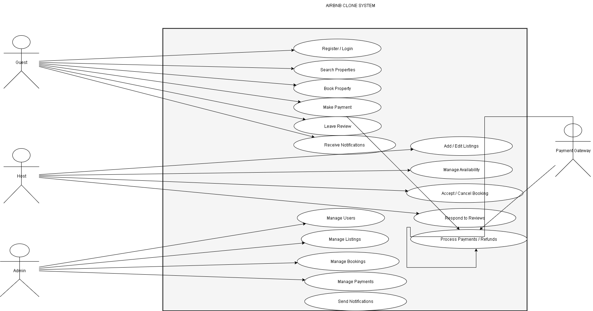

# 🎯 Task 1 – Use Case Diagram

## ✅ Objective
Visualize how actors (**users**, **hosts**, **admins**, **payment system**) interact with the **Airbnb Clone backend system** for its key features and functionalities.

---

## 👥 Key Actors
- **Guest (User/Traveler)** – browses, books, pays, reviews.  
- **Host (Property Owner)** – lists, manages properties, accepts bookings.  
- **Admin** – manages users, listings, bookings, payments.  
- **Payment Gateway (External Service)** – processes payments securely.  

---

## 🔑 Major Use Cases

### For Guest (User)
- Register / Login (via email, OAuth)  
- Update Profile  
- Search Properties (filter by location, price, etc.)  
- Book Property  
- Cancel Booking  
- Make Payment  
- Leave Review / Rating  
- Receive Notifications  

### For Host
- Register / Login  
- Manage Profile  
- Add / Edit / Delete Listings  
- Manage Availability  
- Accept / Cancel Booking  
- Respond to Reviews  

### For Admin
- Manage Users  
- Manage Listings  
- Manage Bookings  
- Manage Payments  
- Monitor Reviews  

### For Payment Gateway
- Process Payment  
- Handle Refunds / Cancellations  

---

## 🖼️ Diagram Layout (Concept)
